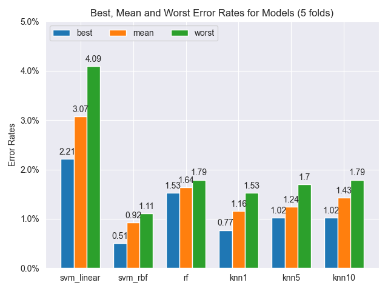
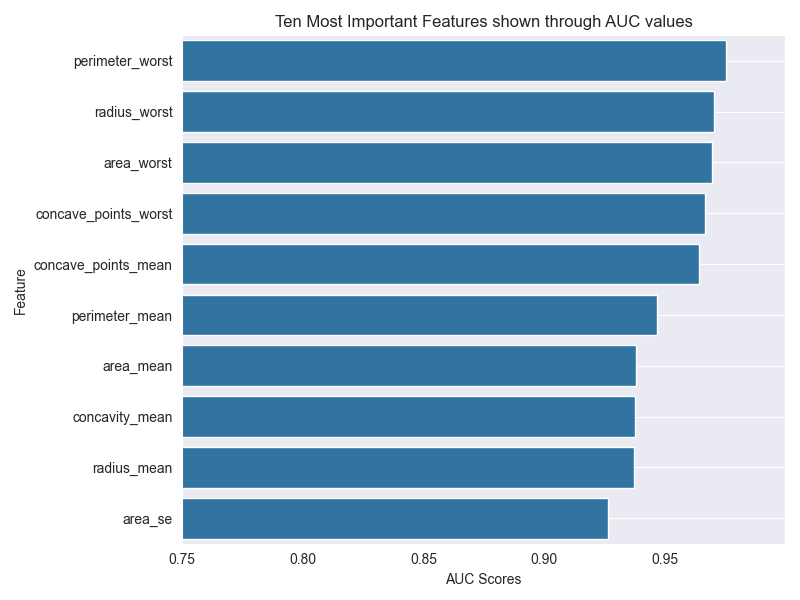
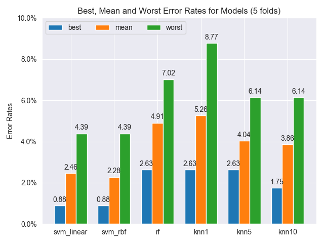
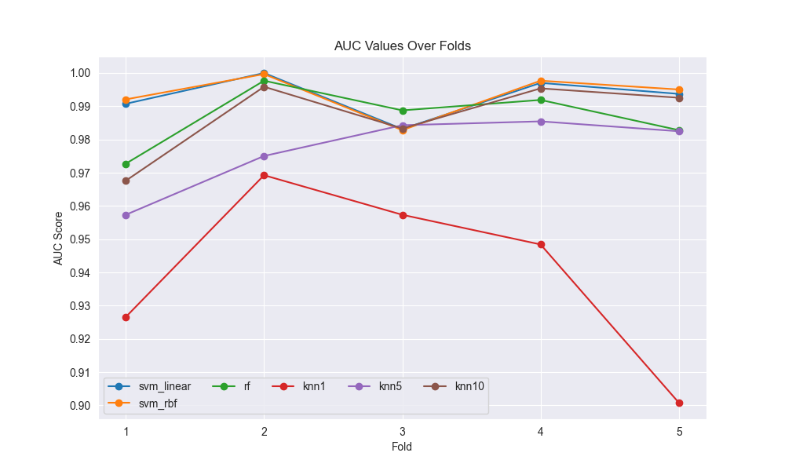

# **CSCI444:Machine Learning Assignment #2** 
Owen Shay
202006664

x2020gft@stfx.ca

November 2nd, 2023

## Dataset and setting up the data
> Like assignment #1, the dataset is the MNIST handwritten digit recognition dataset, but this time it is larger, containing almost quadruple the amount of 28x28px sample images (750 eights and 750 nines in assignment #1 compared to 2920 eights and 2950 nines in this assignment), which should represent a better distribution of the natural variability in handwritten 8s and 9s.

> The data was formatted in a .mat file, and accessed through the 'loadmat' function, storing the data in a dictionary:

    numberFile = loadmat((path.parent / "NumberRecognitionBigger.mat").resolve())

> And were transposed and reshaped to fit the various models dimensional requirements:

    # initializing lists for eights and nines, as well as labels
    eightsNines = []
    eightsNinesLabels = []

    matFile['X'] = matFile['X'].transpose(2, 0, 1).reshape(30000, 784)

> Then I grabbed every eight and nine from the dictionary, since these are the only values we care about for this assignment:

    for i in range(30000):
        if matFile["y"][0][i] == 8:
            eightsNines.append(matFile["X"][i, :])
            eightsNinesLabels.append(matFile["y"][0][i])
        if matFile["y"][0][i] == 9:
            eightsNines.append(matFile["X"][i, :])
            eightsNinesLabels.append(matFile["y"][0][i])

# **Question #1**

> I started off by putting all of the models I was going to be using into a list to loop through, as well as their respective names:

    classifiers = [
        SVC(kernel="linear"),
        SVC(kernel="rbf"),
        RF(n_estimators=100),
        KNeighborsClassifier(n_neighbors=1),
        KNeighborsClassifier(n_neighbors=5),
        KNeighborsClassifier(n_neighbors=10),
    ]

    classifiersLabeled = ["svm_linear", "svm_rbf", "rf", "knn1", "knn5", "knn10"]

> And made a dataframe to store the mean error rates for each model, as well as lists to store the best, worst and mean error rates for each model:

    kfold_scores = pd.DataFrame(
        columns=["svm_linear", "svm_rbf", "rf", "knn1", "knn5", "knn10"], index=["err"]
    )
    kf_score = []

    bestErrorRate = [[], [], [], [], [], []]
    meanErrorRate = [[], [], [], [], [], []]
    worstErrorRate = [[], [], [], [], [], []]

> With these lists, I looped through and ran Stratified K-Fold cross validation on each model:

    for i in range(len(classifiers)):
        
        # setting current classifier from list
        curClassifier = classifiers[i]
        # initializing Stratified K-Fold model
        StratKFold = StratifiedKFold(5, shuffle=True, random_state=40)
    
        # cv parameter set to the stratified k-fold model
        crossVal = cross_validate(
            curClassifier,
            eightsNinesTrain,
            eightsNinesLabels,
            cv=StratKFold,
            scoring="accuracy",
        )

> And grabbed the testing scores and converted them to error rates, then put the mean error rates into the dataframe: 

    # getting highest scoring fold for each model
    bestScore = max(crossVal["test_score"])
    # getting lowest scoring fold for each model
    worstScore = min(crossVal["test_score"])

    bestErrorRate[i].append(round(1 - (bestScore), 4))
    meanErrorRate[i].append(round(1 - (crossVal["test_score"].mean()), 4))
    worstErrorRate[i].append(round(1 - (worstScore), 4))

    kf_score = np.mean(meanErrorRate[i])
    kfold_scores.loc["err", classifiersLabeled[i]] = kf_score

> Here are the results: 

|  Model  |  Mean Error  | 
|:--------|:--------:|
|Linear SVM |3.07%|
|SVM RBF    |0.92%|
|Random Forest|1.58%|
|KNN (1 neighbor)|1.16%|
|KNN (5 neighbors)|1.24%|
|KNN (10 neighbors)|1.43%|

> And Best, Mean and Worst error rates shown through this plot:

> The linear SVM performs the worst by far in this task, with mean error almost doubling the second highest, in Random Forest.

### a) Which classifier performs the best in this task?

> The Radial Basis Function SVM outperformed the rest of the models.

### b) Why do you think this classifier outperforms the others?

> I think it outperforms the others due to the way the radial basis function kernel operates fundamentally. The RBF kernel maps the data to a higher dimensional space, making the data more separable linearly, and the decision boundary that the RBF produces can be very complex, which is good for image classification. The RBF is also a natural similarity measurement, which makes it very strong at classification in general.

### c) How does KNN compare to the results obtained in assignment 1? Why do you observe this comparative pattern? 

> The KNN models with this dataset perform much worse compared to the previous assignment, with K=1's error rate being 1.16% compared to 0% in the first assignment; K=5's error rate being 1.24% compared to 0.25%; and K=10's error rate being 1.43% compared to 0.25%. This can be explained by the larger dataset; which makes the cost of calculating the distance between the new point and each existing point huge and can degrade performance; as well as the increased variability in how the digits are written.

> We observe this comparative pattern to see the correlation between the size of the dataset used and the performance of the model; which is *usually* the opposite of what is displayed here; as more data usually leads to better results. In doing this comparison, we can also observe how more variability in data effects the performance of KNN.

# **Question #2**

## **Dataset Description**
>The dataset I've chosen to use is on breast cancer, formally named the [Breast Cancer Wisconsin (Diagnostic) Dataset](https://www.kaggle.com/datasets/yasserh/breast-cancer-dataset/data). This dataset contains 569 samples with 32 measurements each. Ten of these measurements are unique, and the others are products of further data analysis (ex. radius mean, radius standard error and "worst" radius (worst is the mean of the three largest values present in the sample) are all calculated). 

>These ten features are computed for each cell nucleus: 
1. <u>Radius</u> of distances from center to points on the perimeter. 
2. <u>Texture</u> which is the standard deviation of grey-scale values obtained from x-ray. 
3. <u>Outer Perimeter </u> which is the size of the core tumor.
4. <u>Area</u> of the lobes.
5. <u>Smoothness</u> which is the local variation in radius lengths. 
6. <u>Compactness</u> in lobe structure (calculated using perimeter^2 / area - 1.0). 
7. <u>Concavity</u> which is the severity of concave portions of the contour. 
8. <u>Number of Concave Points</u> which is the number of concave portions of the contour. contour in benign mass is round and oval, and the contour in a malignant mass is irregular and spiculated. 
9. <u>Symmetry</u> of lobe structure. 
10. <u>Fractal Dimension</u> which is a quantification of the complex geometry present within the breast masses at various scales/zoom sizes (calculated using the "coastline approximation" - 1, which is an approximation technique used to represent intricate features of coastlines (or in this case breast cells) in a simplified way).

>The rest are products of these ten, 3 for each measure (mean, standard error and worst) totalling up to 30 measurements, an ID value and a label for each sample.

>The nature of the groups of interest/not of interest is whether or not the tumor present in the breast is malignant (cancerous); denoted as 'M'; or benign (non-cancerous), denoted as 'B'. There are many different combinations of features that all work together in classifying if a tumor is malignant or benign, for example malignant tumors usually have a abnormally high radius and outer perimeter mean values, while benign tumors usually have lower values across the board. 

>Sample counts for the malignant tumors is 212 samples, making up 37% of all samples. The count of benign tumors is 357 samples, making up 63% of all samples. 

> Here is how I have preprocessed the data:

    df = pandas.read_csv("breast-cancer.csv.xls")
    df = df.drop(["id"], axis=1) 
    df["diagnosis"] = df["diagnosis"].replace({"M": 1, "B": 0})

    testingData = df.drop(["diagnosis"], axis=1)
    labels = df["diagnosis"]

> I have normalized this data into a range between 0-1 using sklearns MinMaxScaler function:

    for i in testingData:
        testingData[i] = MinMaxScaler().fit_transform(testingData[i].values.reshape(-1, 1))

## **AUC Values and Analysis**
>Here are the top ten results after analyzing each measurement individually and calculating their AUC scores:

|        Feature        |  AUC  |
|:----------------------|:-----:|
| Worst Perimeter            | 0.975 |
| Worst Radius            | 0.970 |
| Worst Area                | 0.970   |
| Worst Concave Points                  | 0.967   |
| Mean Concave Points                 | 0.964   |
| Mean Perimeter                   | 0.947   |
| Mean Radius                  | 0.938   |
| Mean Area                  | 0.938   |
| Mean Concavity                  | 0.938   |
| Area Standard Error            | 0.926 |

> And visualized through this plot, showing the importance of each feature through their respective AUC scores:

> These AUC scores show which measurements have the most potential to inform prediction within the model. This shows that the Worst Perimeter; or the mean of the largest 3 breast mass perimeter values found in a sample; is the top feature for predicting if a tumor is malignant in this dataset. All of these ten feature's AUC values are very close and all show great potential to inform the predictions as well.

# **Question 3**

> I went about testing and scoring the models with my data very similarly to the way I did in question 1:

    # getting data from helper function
    testingData, labels = breastCancerData(breastCancerDF)

    # just like question 1, initialized list of classifiers to loop through
    classifiers = [
        SVC(kernel="linear"),
        SVC(kernel="rbf"),
        RF(n_estimators=100),
        KNeighborsClassifier(n_neighbors=1),
        KNeighborsClassifier(n_neighbors=5),
        KNeighborsClassifier(n_neighbors=10),
    ]

    # and list of classifier's names
    classifiersLabeled = ["svm_linear", "svm_rbf", "rf", "knn1", "knn5", "knn10"]

    # dictionary to store AUC values over each fold for each model
    testDataDict = {}

    # initializing 2D lists of error rates, each interior list represents each model
    bestErrorRate = [[], [], [], [], [], []]
    meanErrorRate = [[], [], [], [], [], []]
    worstErrorRate = [[], [], [], [], [], []]

    # initializing dataframe of kfold_scores
    kfold_scores = pd.DataFrame(
        columns=["svm_linear", "svm_rbf", "rf", "knn1", "knn5", "knn10"], index=["err"]
    )
    kf_score = []

    # initializing dictionary to make graphing easier
    valuesDict = {
        "best": [0, 0, 0, 0, 0, 0],
        "mean": [0, 0, 0, 0, 0, 0],
        "worst": [0, 0, 0, 0, 0, 0],
    }

> And then ran them through sklearn's cross_validate function, with the cross validator being the Stratified Shuffle Split this time, which behaves very similarly to the Stratified K-Fold function used in question 1:

    for i in range(len(classifiers)):
        # grabbing current classifier from list
        curClassifier = classifiers[i]

        # using Stratified Shuffle Split with 5 folds 
        stratShuffleSplit = StratifiedShuffleSplit(5, test_size=0.2, random_state=40)

        # performing cross validation using sklearn's
        # cross_validate, with cv parameter set to the stratified shuffle split model
        crossVal = cross_validate(
            curClassifier,
            testingData, 
            labels,
            cv=stratShuffleSplit,
            scoring='accuracy',
        )

> And took the testing scores and converted them to error rates, then put the mean error rates into the dataframe: 

    # getting highest scoring fold for each model
    bestScore = max(crossVal["test_accuracy"])
    # getting lowest scoring fold for each model
    worstScore = min(crossVal["test_accuracy"])

    bestErrorRate[i].append(round(1 - (bestScore), 4))
    meanErrorRate[i].append(round(1 - (crossVal["test_accuracy"].mean()), 4))
    worstErrorRate[i].append(round(1 - (worstScore), 4))

    kf_score = np.mean(meanErrorRate[i])
    kfold_scores.loc["err", classifiersLabeled[i]] = kf_score

> Here are the results:

|  Model  |  Mean Error  | 
|:--------|:--------:|
|Linear SVM |2.46%|
|SVM RBF    |2.28%|
|Random Forest|5.09%|
|KNN (1 neighbor)|5.26%|
|KNN (5 neighbors)|4.04%|
|KNN (10 neighbors)|3.86%|

> And best, mean and worst error rates shown through this plot:

> As well as a plot of AUC values over each fold:

###  Is the best performing classifier from Question 1 the same in Question 3?

> Yes, the SVM with Radial Basis Function kernel is the highest performing model once again. It is known to be high performing in classification tasks; due to it being a natural similarity measurement; so this outcome is unsurprising. Unlike question 1 though, the SVM with linear kernel comes in at a close second place to the RBF, most likely due to the fact that the dataset was normalized. Normalization of data is especially important when using the linear kernel, and in doing this you ensure that the linear SVM optimization process is not biased by the magnitude of feature scales (which it fell victim to in question 1), making it into a more robust model. 

# **Bonus Analysis**

### <u>Accuracy, Precision, Recall, F1</u>

> I was curious as to what the accuracy, precision, recall and F1 scores would look like for these tests, so I wanted to calculate them. Here are my findings for the number recognition and breast cancer datasets, Here are my results:

<u> **Number Recognition Scores** </u>

|  Model  |  Accuracy  |  Precision  |  Recall  |  F1 Score  | 
|:--------|:----------:|:-----------:|:--------:|:----------:|
|Linear SVM |0.969|0.974|0.964|0.969|                             
|SVM RBF    |0.991&#9733;|0.988|0.993&#9733;|0.991&#9733;|
|Random Forest|0.984|0.98|0.988|0.984|
|KNN (1 neighbor)|0.988|0.995&#9733;|0.982|0.988|
|KNN (5 neighbors)|0.988|0.994|0.981|0.987|
|KNN (10 neighbors)|0.982|0.994|0.97|0.982|

<u> **Breast Cancer Prediction Scores** </u>

|  Model  |  Accuracy  |  Precision  |  Recall  |  F1 Score  | 
|:--------|:----------:|:-----------:|:--------:|:----------:| 
|Linear SVM |0.975|0.995&#9733;|0.939|0.966|                                                 
|SVM RBF    |0.977&#9733;|0.981|0.957&#9733;|0.969&#9733;| 
|Random Forest|0.968|0.976|0.939|0.957| 
|KNN (1 neighbor)|0.947|0.927|0.934|0.93| 
|KNN (5 neighbors)|0.968|0.971|0.943|0.957| 
|KNN (10 neighbors)|0.972|0.99|0.934|0.961| 
  
> As seen in the tables, the SVM with Radial Basis Function kernel performs the best in every category for both datasets; other than precision; where the KNN with 1 neighbor outperforms it in number recognition and the SVM with linear kernel outperforms in cancer prediction. In either of these tasks I would still opt to use the RBF SVM over the other models tested.   
